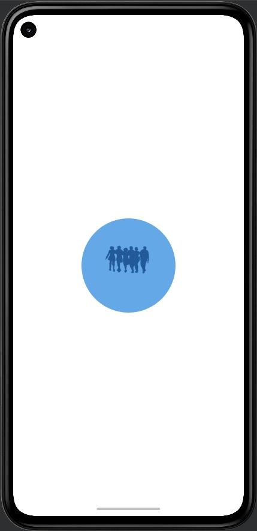
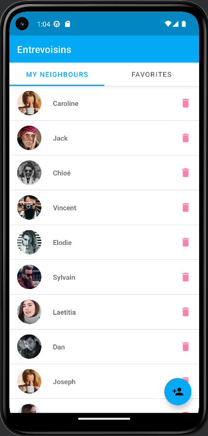
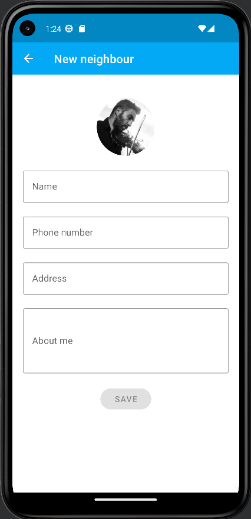
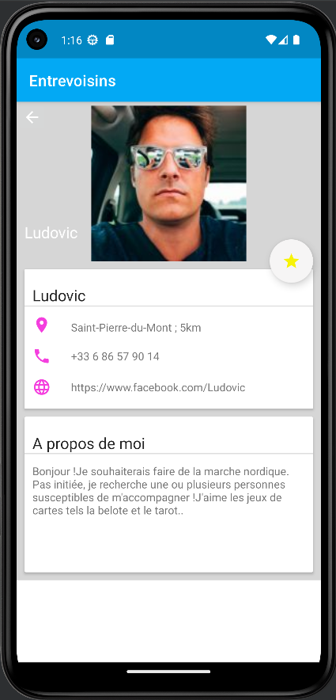
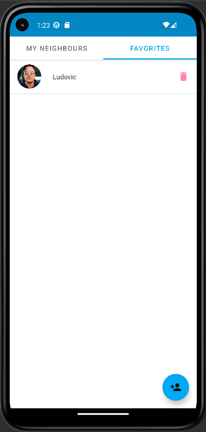

<h1 style="color: steelblue; font-size: 24px;"> <strong> ENTREVOISINS </strong> </h1>

<h2 style="color: skyblue; font-size: 22px;"> <strong> Description </strong> </h2>

Entrevoisins est une application qui permet à des personnes d’un même quartier de se rendre des petits services : 

✔️ garde d’animaux,  
✔️ petit bricolage,  
✔️ troc d’objets,  
✔️ cours particuliers,  
✔️ etc.

<ins> Fonctionnalités </ins> :

➡️ Lister les voisins  
➡️ Ajouter un ou plusieurs voisins  
➡️ Supprimer un ou plusieurs voisins  
➡️ Visualiser l'écran de détails d'un voisin  
➡️ Mettre en favori un ou plusieurs voisins

Pour information, il s'agit du projet n°3 du parcours de développeur d'applications Android, de la plateforme OPENCLASSROOMS.

<h2 style="color: #37B6FA; font-size: 22px;"> <strong> Prérequis </strong> </h2>

Java JDK : corretto-11  
Version SDK : 33 / Minimum : 21  
Version Java : 1_8

<h2 style="color: #37B6FA; font-size: 22px;"> <strong> Installation / Compilation / Exécution </strong> </h2>

1. Dans Android Studio, cliquez sur `File` (Fichier) puis `New` (Nouveau) puis `Project from Version Control` (Projet à partir du contrôle de version) et enfin `Git`
2. Copiez-collez l'URL suivante : https://github.com/Galaktik5962/OpenClassrooms_P3_Entrevoisins.git
3. Choississez le dossier de destination
4. Cliquez sur `Clone` (Cloner)
5. Patientez pendant le téléchargement des fichiers
6. Cliquez sur `OK` pour ouvrir le projet
7. Choississez un émulateur ou connectez votre téléphone
8. Cliquez sur `Run` (Exécuter) pour lancer l'application 

 

Il est aussi possible de passer par <strong> Git Bash </strong> : 

1. Clonez ce repository sur votre ordinateur en utilisant cette commande : git clone https://github.com/Galaktik5962/OpenClassrooms_P3_Entrevoisins.git
2. Dans Android Studio, cliquez sur `File` (Fichier) puis `Open` (Ouvrir) et sélectionnez le dossier qui correspond au projet cloné
3. Attendez que le projet soit importé dans Android Studio 

 

⚠️ <strong> A noter </strong> : Au lancement d'Android Studio, le projet se compile normalement automatiquement. Si ce n'est pas le cas, cliquez sur le marteau vert dans la barre d'outils en haut à droite de l'écran.

 

 

<h2 style="color: #37B6FA; font-size: 22px;"> <strong> Description </strong> </h2>

Entrevoisins is an application that allows people from the same neighborhood to provide each other with small services:

✔️ Pet sitting,  
✔️ Small DIY tasks,  
✔️ Object bartering,  
✔️ Private lessons,  
✔️ etc.

<ins> Features </ins>:

➡️ List neighbors  
➡️ Add one or more neighbors  
➡️ Remove one or more neighbors  
➡️ View the details screen of a neighbor  
➡️ Mark one or more neighbors as favorites  

For information, this is project number 3 of the Android application developer course on the OPENCLASSROOMS platform.

<h2 style="color: #37B6FA; font-size: 22px;"> <strong> Prerequisites </strong> </h2>

Java JDK: corretto-11  
SDK Version: 33 / Minimum: 21  
Java Version: 1_8

<h2 style="color: #37B6FA; font-size: 22px;"> <strong> Installation / Compilation / Execution </strong> </h2>

1. In Android Studio, click on `File` then `New` then `Project from Version Control` and finally `Git`
2. Copy and paste the following URL: https://github.com/Galaktik5962/OpenClassrooms_P3_Entrevoisins.git
3. Choose the destination folder
4. Click on `Clone`
5. Wait for the files to download
6. Click `OK` to open the project
7. Choose an emulator or connect your phone
8. Click on `Run` to launch the application

 

You can also use <strong> Git Bash </strong>:

1. Clone this repository on your computer using this command: git clone https://github.com/Galaktik5962/OpenClassrooms_P3_Entrevoisins.git
2. In Android Studio, click on `File` then `Open` and select the folder that corresponds to the cloned project
3. Wait for the project to be imported into Android Studio

 

⚠️ Note: At the launch of Android Studio, the project should be automatically compiled. If it is not the case, click on the green hammer in the top right corner of the screen.

 

 

<h2 style="color: #37B6FA; font-size: 22px;"> <strong> Galerie d'images / Image gallery </strong> </h2>

  

  
  
  

  
  

