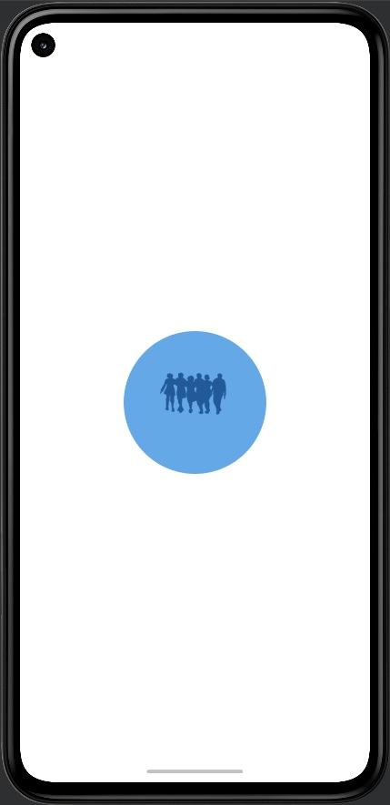

## Introduction

Entrevoisins est une application qui permet à des personnes d’un même quartier de se rendre des petits services : 

> garde d’animaux
> petit bricolage
> troc d’objets
> cours particuliers
> etc...

## Installation

Comment accèder au projet sur votre ordinateur ?

1. Dans Android Studio, cliquez sur `File` puis `New` puis `Project from Version Control` et enfin `Git`
2. Copiez-collez l'URL suivante : https://github.com/Galaktik5962/OpenClassrooms_P3_Entrevoisins.git
3. Choississez le dossier de destination
4. Cliquez sur `Clone`
5. Patientez pendant le téléchargement des fichiers
6. Cliquez sur `OK` pour ouvrir le projet
7. Choississez un émulateur ou connectez votre téléphone
7. Cliquez sur `Run` pour lancer l'application

-----------------------------------------------------------------------------------------------------------------------------

## Introduction

Entrevoisins is an application that allows people from the same neighborhood to do small favors:

> animal care
> small DIY
> object barter
> private lessons
> etc.

## Facility

How to access the project on your computer?

1. In Android Studio, click on `File` then `New` then `Project from Version Control` and finally `Git`
2. Copy-paste the following URL: https://github.com/Galaktik5962/OpenClassrooms_P3_Entrevoisins.git
3. Choose the destination folder
4. Click on `Clone`
5. Wait while downloading files
6. Click `OK` to open the project
7. Choose an emulator or connect your phone
8. Click on `Run` to launch the application